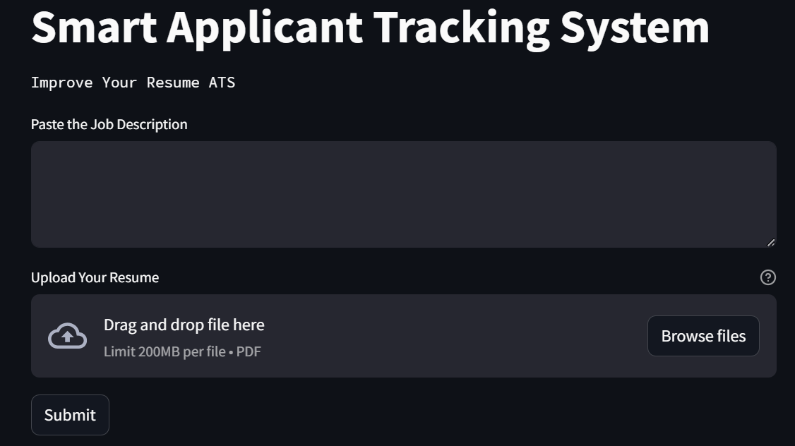

Applicant Tracking Systems

Development of an ATS Large Language Application aimed at revolutionizing resume crafting for job seekers.
Purpose: To aid job seekers in optimizing their resumes for Applicant Tracking Systems (ATS) by providing feedback on keyword matches and profile summary alignment with posted job descriptions.

Key features:
Keyword Matching: The application analyzes resumes and job descriptions to identify matching keywords and calculates a percentage match.
Profile Summary Optimization: Provides insights on areas where the profile summary can be enhanced to better align with the job requirements.
Missing Keywords Identification: Flags missing keywords in the resume compared to the job description, helping users tailor their resumes accordingly.

Importance: In today's competitive job market, understanding and optimizing for ATS is essential for getting noticed by employers.
User Benefit: Empowers job seekers to increase their chances of getting selected for interviews by ensuring their resumes are ATS-friendly and tailored to specific job postings.

Innovative Approach: Leveraging large language models and natural language processing techniques to analyze resumes and job descriptions comprehensively.
User-Friendly Interface: Intuitive interface for easy resume analysis and optimization, catering to users with varying levels of technical proficiency.

Image 1: Represents the developed user interface, showcasing the design and layout.

Image 2: Depicts a user inputting job descriptionn and uploading resume.

Image 3: Illustrates the generated response by the application based on the user's input.
